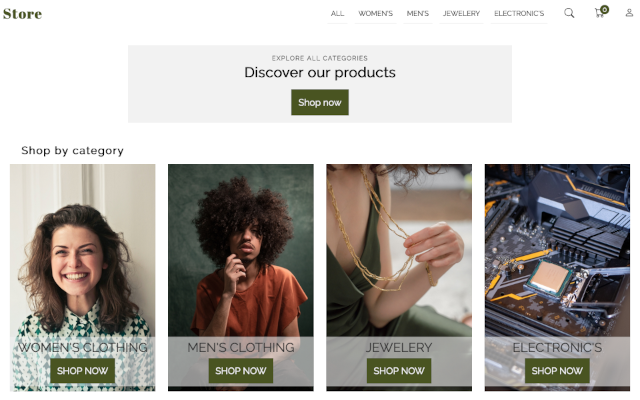

[![LinkedIn][linkedin-shield]][linkedin-url]

<h3 align="center">E-commerce-app</h3>

  

    Front-end project
     
     
    <a href="https://store-e-commerce-app.netlify.app">View Demo</a>
    ·
    <a href="https://github.com/malgo-slota/e-commerce-app/issues">Report Bug</a>
  

  

    
  

<!-- TABLE OF CONTENTS -->

  
Table of Contents

  <ol>
    <li>
      <a href="#about-the-project">About The Project</a>
      <ul>
        <li><a href="#built-with">Built With</a></li>
      </ul>
    </li>
    <li><a href="#usage">Usage</a></li>
    <li><a href="#continued-development">Continued development</a></li>
    <li><a href="#contact">Contact</a></li>
  </ol>

<!-- ABOUT THE PROJECT -->
## About The Project

Plan for creating this project was realised. It contains only front-end part of e-commerce site, to simmulate full functionallity of a real store. Focus was mostly on high accessiblity, according to lighthouse raport it is 100% on mobile and desktop. It is possible to navigate only with keyboard, and by using screen reader.
I think the whole design part could be better if it was planned previously (for example If I created mockup's in figma). But it was created on the fly, and wasn't my main focus. 
My main focus was to learn React useContext hook, react Router, train components in more complex structure than in my previous React projects, learn Styled-components (by the way my opinion on that: it is a very comfort way for writting style, but what concern me is am I using it according to best practices, a lot of styling is repeating).

(<a href="#readme-top">back to top</a>)

### Built With

API: https://fakestoreapi.com/

(<a href="#readme-top">back to top</a>)

<!-- USAGE EXAMPLES -->
## Usage

- view the optimal mobile and desktop layout
- navigate using keyboard
- handle page using screen reader
- view login and register page
- view 404 page
- see loading screen when API is called
- add items to cart with simple animation
- remove items from cart
- display cart page
- display single product page with details
- display all products, search products by category or by search results
- proceed to checkout/shipping pages
- see summary page
- place order (clear the cart and redirect to homepage)
- see error messages for incorect inputs in forms

(<a href="#readme-top">back to top</a>)

<!-- ROADMAP -->
## Continued development

- possibilitiy of adding the same product more than once
- working quantity buttons, affecting product price and total sum in the cart
- performance improvements

(<a href="#readme-top">back to top</a>)

<!-- CONTACT -->
## Contact

- LinkedIn - [Małgorzata Słota](https://www.linkedin.com/in/malgorzata-slota/)

(<a href="#readme-top">back to top</a>)

[linkedin-shield]: https://img.shields.io/badge/-LinkedIn-black.svg?style=for-the-badge&logo=linkedin&colorB=555
[linkedin-url]: https://linkedin.com/in/othneildrew